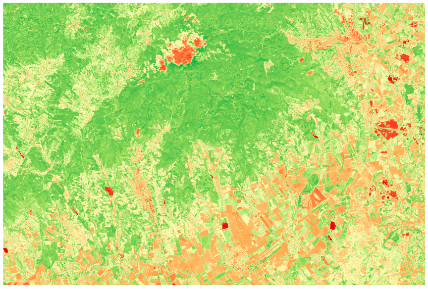

# py-gdal-indices
Sentinel-2 satellite imagery processing with Python and GDAL.

## About
This project analyzes the effects of the 2021 summer drought on vineyards and water bodies in the Eger wine region using multispectral satellite imagery.

Two spectral indices are calculated from Sentinel-2 L2A bands:
- **NDVI** (Normalized Difference Vegetation Index) - measures vegetation health
- **NDWI** (Normalized Difference Water Index) - detects open water surfaces

## Preview


## Dependencies
- Python 3.x
- GDAL
- NumPy

## Usage
1. Download a Sentinel-2 L2A scene from [Copernicus Data Space](https://dataspace.copernicus.eu) and place it in `data/`
2. Optionally crop the scene to your area of interest: `src/crop.py`
3. Run the index calculator: `src/index_calculator.py`
4. Output files are saved to `data/` as GeoTIFF (`.tif`)

## Project structure
```
py-gdal-indices/
├── src/
│   ├── index_calculator.py   # NDVI and NDWI calculation
│   └── crop.py               # optional area cropping
├── docs/
│   └── Python_GDAL_modul.pdf # project documentation (Hungarian)
├── img/  					  # preview images
├── data/                     # satellite data, gitignored
└── .gitignore
```

## Data
Sentinel-2 scene used: `S2B_MSIL2A_20210708T094029_N0500_R036_T34UDU`
- Date: 2021-07-08
- Cloud coverage: <5%
- Tile: T34UDU (UTM 34N)